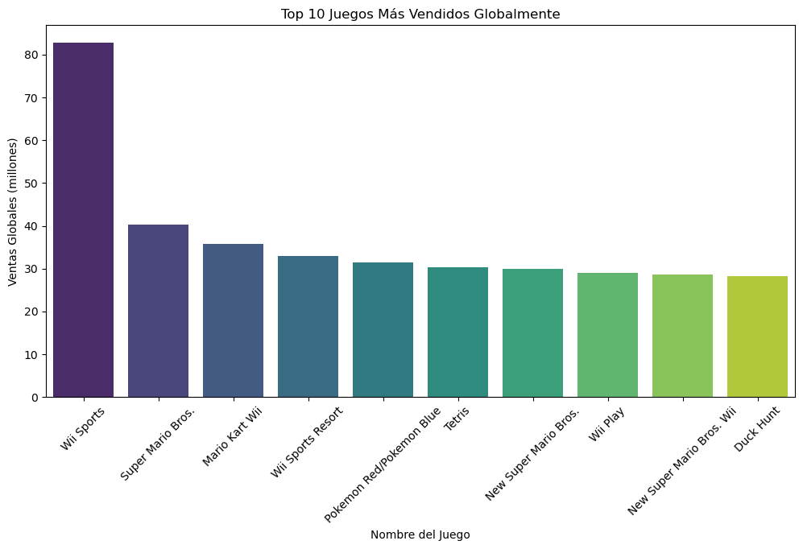
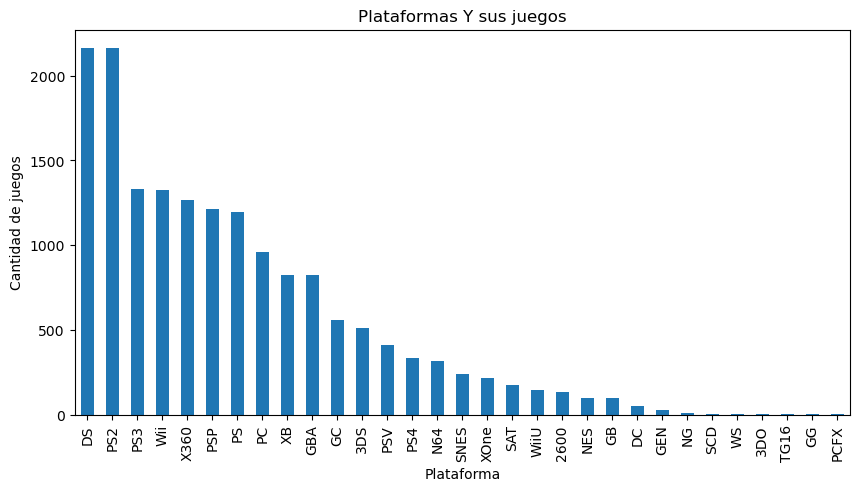

# Análisis de Datos de Videojuegos

## 1️⃣ Ventas

### Top juegos por ventas globales
- **Objetivo:** Mostrar los 10–20 juegos más vendidos.
- **Visualización:** Gráfico de barras horizontales.

### Ventas por plataforma
- **Objetivo:** Total de ventas por consola o plataforma.
- **Visualización:** Gráfico de barras o pastel.

### Ventas por región
- **Objetivo:** Comparar ventas en Norteamérica, Europa, Japón y otras regiones.
- **Visualización:** Mapa de calor o gráfico de columnas apiladas.

### Evolución de ventas por año
- **Objetivo:** Cómo cambian las ventas a lo largo del tiempo.
- **Visualización:** Gráfico de líneas o área.

---

## 2️⃣ Género de juegos

### Géneros más populares
- **Objetivo:** Número de juegos lanzados por género o ventas totales por género.
- **Visualización:** Gráfico de pastel, barras o treemap.

### Popularidad por año
- **Objetivo:** Qué géneros dominaron cada año.
- **Visualización:** Gráfico de líneas apiladas o área apilada.

---

## 3️⃣ Editoriales / Publishers

### Top publishers por ventas
- **Objetivo:** Quién generó más ingresos totales.
- **Visualización:** Gráfico de barras.

### Cantidad de juegos lanzados por publisher
- **Objetivo:** Qué tan activos son los publishers.
- **Visualización:** Gráfico de barras horizontales.

### Ventas por publisher y plataforma
- **Objetivo:** Qué publisher tuvo más éxito en cada consola.
- **Visualización:** Gráfico de columnas apiladas o matriz.

---

## 4️⃣ Tendencias temporales

### Número de lanzamientos por año
- **Objetivo:** Ver si hay años con más actividad.
- **Visualización:** Gráfico de líneas o columnas.

### Ventas promedio por año
- **Objetivo:** Cómo cambia el éxito promedio de un juego con los años.
- **Visualización:** Gráfico de líneas.

### Género más exitoso por año
- **Objetivo:** Qué géneros vendieron más cada año.
- **Visualización:** Gráfico de área apilada.

---

## 5️⃣ Análisis comparativo

### Comparar ventas vs año de lanzamiento
- **Objetivo:** Detectar si los juegos más antiguos siguen vendiendo.
- **Visualización:** Gráfico de dispersión.

### Comparar puntuación de usuarios/críticos vs ventas
- **Objetivo:** Ver si los juegos mejor evaluados vendieron más.
- **Visualización:** Gráfico de dispersión o burbuja.

### Correlación entre ventas regionales
- **Objetivo:** Saber si un éxito en EE.UU. también lo fue en Europa o Japón.
- **Visualización:** Heatmap o matriz de correlación.
